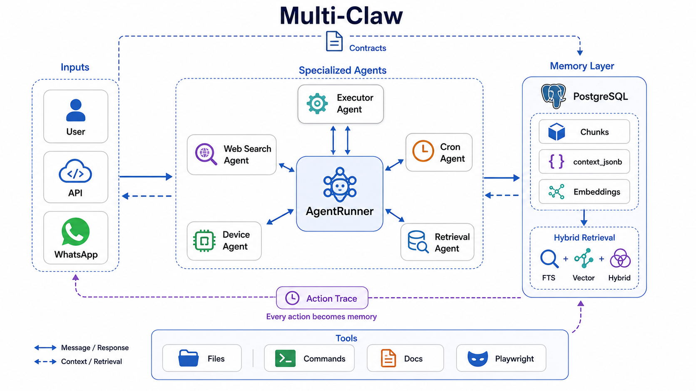

# Multi-Claw


**Multi-Claw es un laboratorio local de agentes autonomos con memoria profunda.**

No es "un chatbot con herramientas": es un runtime para agentes que trabajan, delegan, ejecutan, guardan trazabilidad y luego pueden reconstruir que paso.

```text
Multi-Claw = multiagente + memoria accionable + workflows + runtime local
```



## Highlights

- 🧠 **Memoria operacional:** conversaciones, chunks, `context_jsonb`, decisiones, tools, subagentes y artefactos.
- ⚙️ **Agentes autonomos:** tareas periodicas tipo cron, con estado y trazabilidad.
- 🧩 **Workflows versionables:** playbooks, prompts y SQL templates como habilidades reutilizables.
- 💸 **Menos coste/context rotting:** subtareas delegables a agentes/modelos mas baratos.
- 🛡️ **Aislamiento extra:** agentes, contratos y tools separados reducen superficie ante prompt injection.
- 🔎 **Retrieval multitemporal:** consultas por sesion, fecha, evento, herramienta, subagente o texto literal.

> En uso real interno ha funcionado bien con historiales de mas de 20M tokens. Falta benchmark formal: prometedor, no una garantia.

## Frente A OpenClaw Y Similares

OpenClaw esta mas maduro como producto: mejor instalacion, mas canales, mas ecosistema y una memoria muy trabajada con archivos, SQLite/hybrid search, QMD, Honcho y wiki.

Multi-Claw vende otra cosa: **memoria como caja negra consultable de la ejecucion del agente**.

| Area | OpenClaw / similares | Multi-Claw |
| --- | --- | --- |
| Producto | Mas pulido | Mas experimental y hackeable |
| Memoria | Notas, sesiones, indices y backends | PostgreSQL + chunks + `context_jsonb` |
| Foco | Asistente local completo | Auditoria, retrieval y automatizacion profunda |
| Recall | Knowledge/user memory | Acciones, tools, subagentes y temporalidad |
| Coste | Runtime generalista | Delegacion multiagente para contener contexto |
| Seguridad | Ecosistema mas maduro | Aislamiento por agentes/contratos como capa adicional |

Referencias: [OpenClaw Memory](https://docs.openclaw.ai/concepts/memory) y [OpenClaw Multi-Agent](https://docs.openclaw.ai/concepts/multi-agent).

## Casos Que Quiere Resolver

- "Que decision tomo el agente sobre este proyecto hace tres semanas?"
- "Que subagente genero este archivo y bajo que contrato?"
- "Que tool fallo antes de que apareciera este bug?"
- "Donde se mezclan tema A, fecha B y herramienta C?"
- "Que preferencias del usuario cambiaron esta respuesta?"

## Estado Real

Experimental, local-first y todavia no empaquetado como producto. Necesita `OPENAI_API_KEY`, PostgreSQL y, recomendado, Redis. `pgvector` activa la busqueda vectorial; sin el, los embeddings quedan guardados pero no hay retrieval vectorial real.

No expongas esto a Internet sin revisar auth, CORS, tools de comandos y permisos de escritura.

## Arranque Rapido Para Un Clone Nuevo

```bash
git clone <url-del-repo>
cd multi-claw
export OPENAI_API_KEY="sk-..."
docker compose up --build
```

Abre `http://localhost:8000`.

## Stack

| Capa | Tecnologia |
| --- | --- |
| API | FastAPI + Uvicorn |
| Agentes | OpenAI Responses API |
| Memoria | PostgreSQL, pgvector/HNSW, FTS, JSONB |
| Cache | Redis |
| UI | `index.html` |
| Automatizacion | crons + workflows |
| Canales | HTTP + Twilio/WhatsApp opcional |
| Tools | archivos, comandos, docs, Playwright |

No commitees `.env`, claves, dumps, screenshots privados ni memoria personal.

## Configuracion Minima

```env
OPENAI_API_KEY=sk-...
CHAT_API_KEY=change-me
WORKING_PATH=./working-dir

MULTIAGENT_PG_HOST=localhost
MULTIAGENT_PG_PORT=5432
MULTIAGENT_PG_DB=multiagente
MULTIAGENT_PG_USER=admin
MULTIAGENT_PG_PASSWORD=change-me
MULTIAGENT_PG_SCHEMA=multiagente

REDIS_URL=redis://localhost:6379
```

Opcionales utiles: `MEMORY_RETRIEVAL_MODE=vector|keyword|hybrid`, `TWILIO_*`, `CRONS_PATH`, `WORKFLOW_PATH`, `USER_PREFERENCES_PATH`, `ALLOWED_WRITE_ROOTS`.

## Arranque Con Docker

```bash
docker compose up --build
```

Para parar:

```bash
docker compose down
```

## Arranque Local Sin Docker

```bash
python -m venv .venv
source .venv/bin/activate
pip install -r requirements.txt
playwright install chromium
uvicorn main:app --reload --host 0.0.0.0 --port 8000
```

Si arrancas desde otro directorio, las rutas relativas de `.env` se resuelven respecto a la raiz del proyecto mediante `app_paths.py`.

## API

```http
POST /chat
Content-Type: application/json
X-API-Key: <si CHAT_API_KEY esta definido>
```

```json
{
  "session_id": "demo",
  "username": "usuario",
  "message": "Hola",
  "conversation_type": null
}
```

Tambien acepta `images` con `url`, `path`, `data_url`, `file_id` o `base64`.

- `GET /conversations`
- `GET /conversations/{session_id}`
- `DELETE /session/{session_id}`
- `DELETE /conversations/{session_id}`
- `POST /twilio/webhook`

## Memoria

La parte fuerte. Multi-Claw trata la memoria como historial consultable de ejecucion, no solo como notas o resumen inyectado.

1. Divide texto conversacional en chunks semanticos.
2. Genera embeddings con OpenAI.
3. Guarda chunks en `multiagente.conversation_chunks`.
4. Recupera por vector, keyword o hibrido.
5. Baja a `conversations.context_jsonb` cuando hace falta literalidad o cronologia.

El workflow `working-dir/workflows/memory_retrieval_tutorial` documenta el playbook de retrieval: clasificar intencion, reducir espacio de busqueda, combinar FTS/vector/hibrido y abrir JSON solo cuando compensa.

## Tests

```bash
python -m unittest
```

Los tests son unitarios. Conviene tener `OPENAI_API_KEY` definida aunque sea con un valor de desarrollo; no hacen llamadas reales a OpenAI.

## Seguridad Antes De Compartir O Exponer

Herramienta local con mucho poder. Antes de compartir: `CHAT_API_KEY`, CORS restringido, passwords cambiadas, Postgres/Redis no expuestos, `ALLOWED_WRITE_ROOTS` limitado y revision de `working-dir/`.

## Mejoras Recomendadas

- `.env.example` sin secretos.
- Modo `dev/prod` claro.
- Healthcheck de API/DB/Redis/OpenAI.
- CI con `python -m unittest` y build Docker.
- Benchmarks formales de memoria: recall, precision, coste y temporalidad.
- Hardening de tools, CORS, auth y permisos multiusuario.

## Estructura

```text
.
├── main.py
├── app_paths.py
├── index.html
├── docs/architecture.png
├── agents/
├── runner/
├── tools/
│   └── memoryTools/
├── data/
├── integrations/twilio/
├── tests/
├── working-dir/workflows/memory_retrieval_tutorial/
├── Dockerfile
└── docker-compose.yml
```
